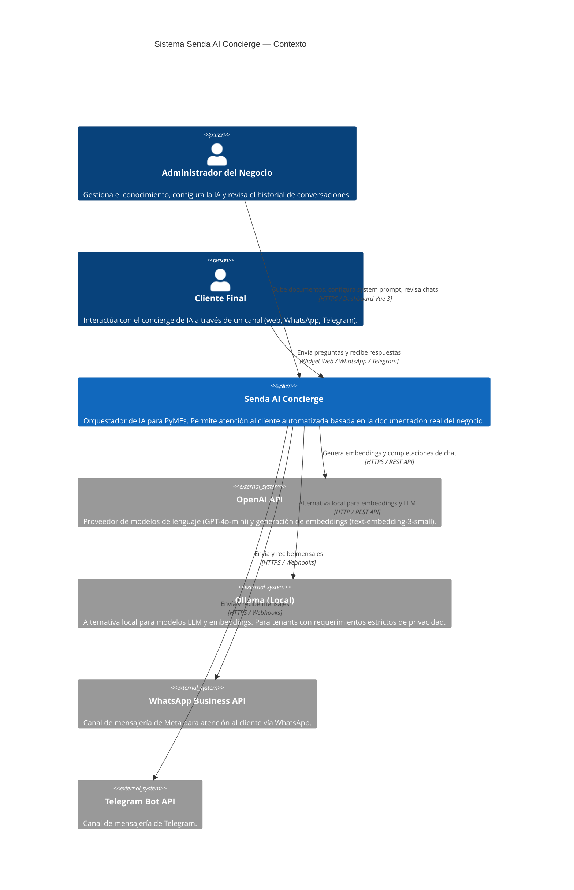
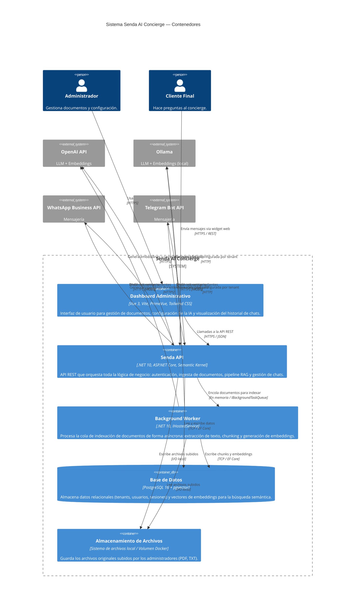

# Diagramas de Arquitectura C4 — Senda AI Concierge

Estos diagramas siguen el modelo **C4** (Context, Container, Component, Code) para describir la arquitectura del sistema en niveles progresivos de detalle.

---

## Nivel 1 — Contexto del Sistema

Muestra qué es Senda, quién lo usa y con qué sistemas externos se comunica. Es el punto de entrada para cualquier persona que llega al repositorio por primera vez.

---

## Nivel 2 — Contenedores

Muestra las piezas tecnológicas que componen Senda: qué procesos corren, qué tecnologías usan y cómo se comunican entre sí.

---

## Notas de Arquitectura

### Sobre el Background Worker
El `Background Worker` es un `IHostedService` de .NET que corre dentro del mismo proceso que la `Senda API`. Esto evita la necesidad de un servicio separado (como un worker de Kubernetes o una función serverless) en el despliegue inicial. La comunicación es vía una cola en memoria (`IBackgroundTaskQueue`), implementada con `Channel<T>` de .NET.

**Implicación:** Si la API se reinicia durante el procesamiento de un documento, los jobs en memoria se pierden. Para el MVP esto se maneja con el estado `Processing` → detección al arranque → re-encolado automático. Post-MVP se puede migrar a una cola persistente (Redis Streams, RabbitMQ).

### Sobre el Almacenamiento de Archivos
Para el MVP, los archivos se almacenan en el sistema de archivos local del contenedor, montado como un volumen Docker. Esto es suficiente para un despliegue en VPS. La interfaz `IFileStorageService` abstrae la implementación, permitiendo migrar a S3/Azure Blob Storage sin cambiar la lógica de negocio.

### Sobre los Canales de Mensajería
WhatsApp y Telegram se integran vía webhooks: los proveedores envían mensajes entrantes como HTTP POST a endpoints de Senda. Senda procesa el mensaje, construye la respuesta vía RAG y llama a la API del proveedor para enviarla. El endpoint del webhook se configura por `ChatChannel`.
