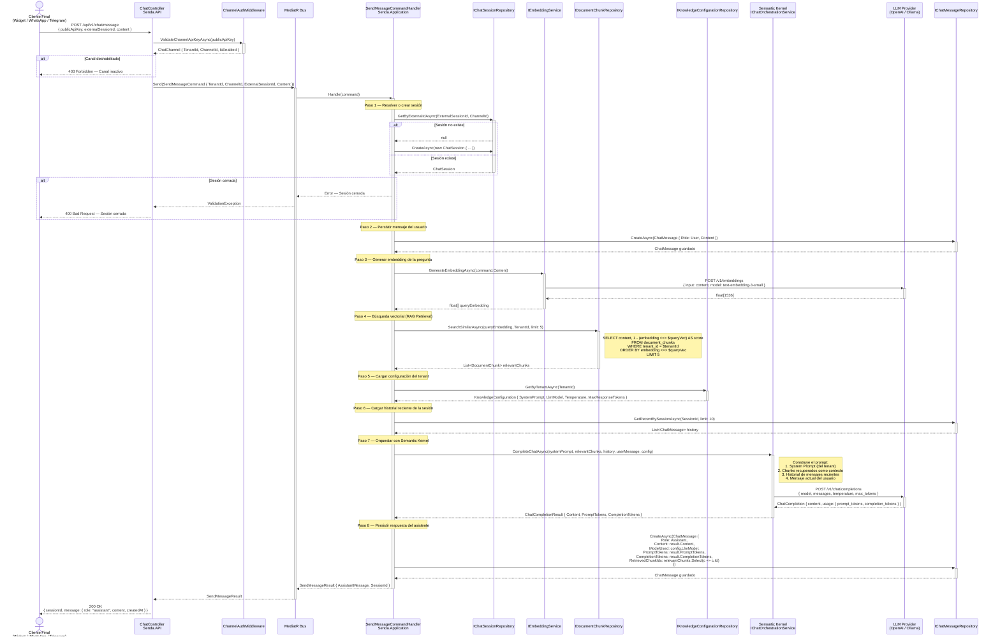
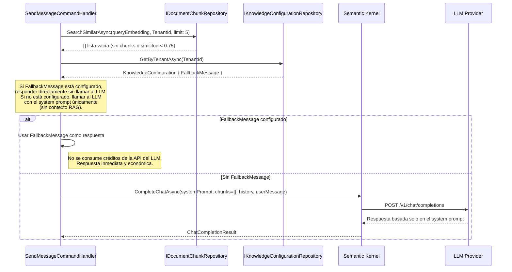
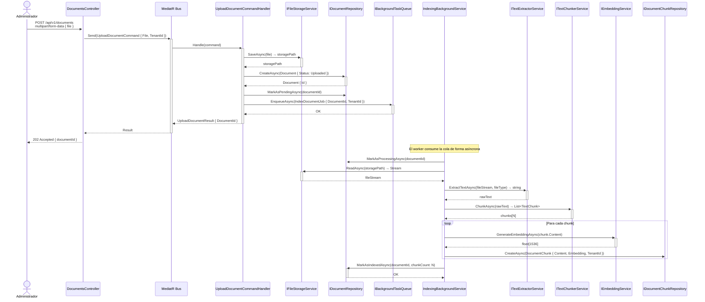

# Diagrama de Secuencia — Flujo de Chat

Este diagrama describe el flujo completo a nivel de componentes para un mensaje de usuario final, desde que llega al endpoint de la API hasta que la respuesta es devuelta. Es la referencia principal para implementar los handlers de la capa `Senda.Application`.

---

## Flujo Principal — Mensaje de chat con contexto RAG

---

## Flujo Alternativo — Sin documentos indexados

Cuando el tenant no tiene documentos indexados o ningún chunk supera el umbral mínimo de similitud, el sistema responde con un mensaje de fallback en lugar de intentar fabricar una respuesta sin contexto.

---

## Flujo de Indexación — Referencia rápida

---

## Convenciones para la Implementación

Al implementar los handlers basándote en estos diagramas, se deben seguir las siguientes convenciones:

**Nomenclatura de interfaces:** Todas las interfaces del diagrama viven en `Senda.Core.AIConcierge`. Sus implementaciones concretas viven en `Senda.Infrastructure`.

**Manejo de errores:** Cualquier excepción lanzada dentro de un handler es capturada por el `ExceptionHandlingBehavior` de MediatR (definido en ADR-006), que la convierte en una respuesta de error estructurada con `ProblemDetails`.

**Cancelación:** Todos los métodos asincrónicos reciben un `CancellationToken` que debe propagarse hasta las llamadas a la API externa (OpenAI/Ollama) para evitar requests huérfanos si el cliente se desconecta.

**Logs:** El `LoggingBehavior` de MediatR registra automáticamente la entrada y salida de cada handler. Dentro de los handlers no se debe duplicar ese logging; solo se loguean eventos de negocio relevantes (ej. "Documento indexado con N chunks").
