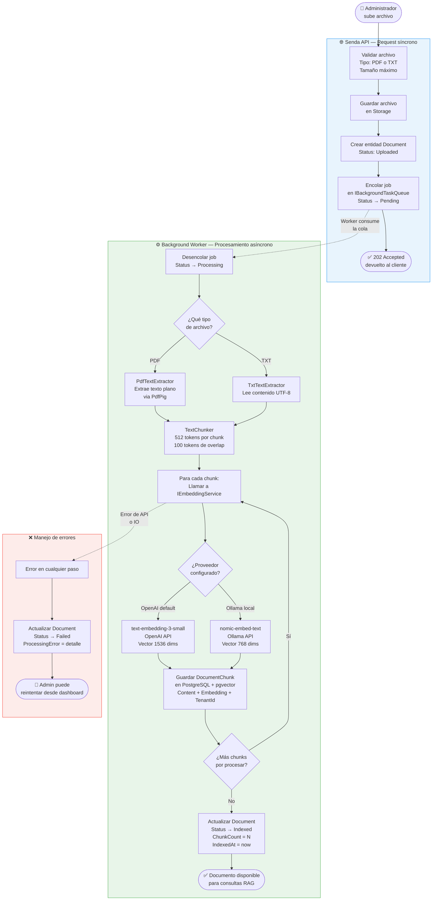
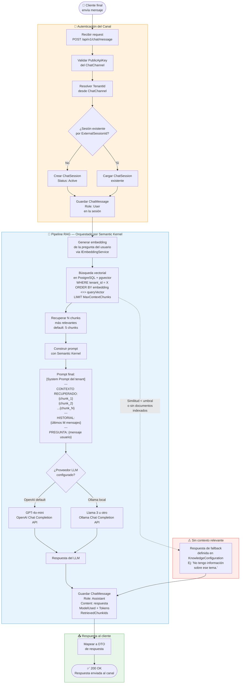
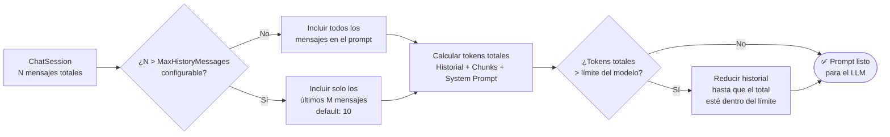

# Diagrama del Pipeline RAG — Senda AI Concierge

El pipeline RAG (Retrieval-Augmented Generation) es el corazón del módulo AI Concierge. Se divide en dos fases independientes: **Indexación** (cuando el administrador sube un documento) y **Recuperación** (cuando un cliente hace una pregunta).

---

## Fase 1 — Indexación (Write Path)

Se ejecuta de forma asíncrona en el `Background Worker` cada vez que un administrador sube un documento nuevo o actualizado.

---

## Fase 2 — Recuperación (Read Path)

Se ejecuta de forma síncrona en cada mensaje de un usuario final, a través del endpoint de chat.

---

## Control del Historial de Chat (Context Window Management)

Un detalle crítico del pipeline es cuántos mensajes anteriores se incluyen en el prompt para mantener el contexto de la conversación, sin exceder el límite de tokens del modelo.

---

## Resumen de Responsabilidades por Componente

| Componente | Responsabilidad en el Pipeline |
|---|---|
| `ITextExtractorService` | Extrae texto plano de PDF o TXT |
| `ITextChunkerService` | Divide el texto en chunks de 512 tokens con 100 de overlap |
| `IEmbeddingService` | Genera el vector de 1536 dims (OpenAI) o 768 dims (Ollama) |
| `IDocumentChunkRepository` | Persiste y consulta chunks en PostgreSQL + pgvector |
| `IChatOrchestrationService` | Coordina el flujo completo de recuperación vía Semantic Kernel |
| `IFileStorageService` | Lee y escribe archivos en el sistema de almacenamiento |
